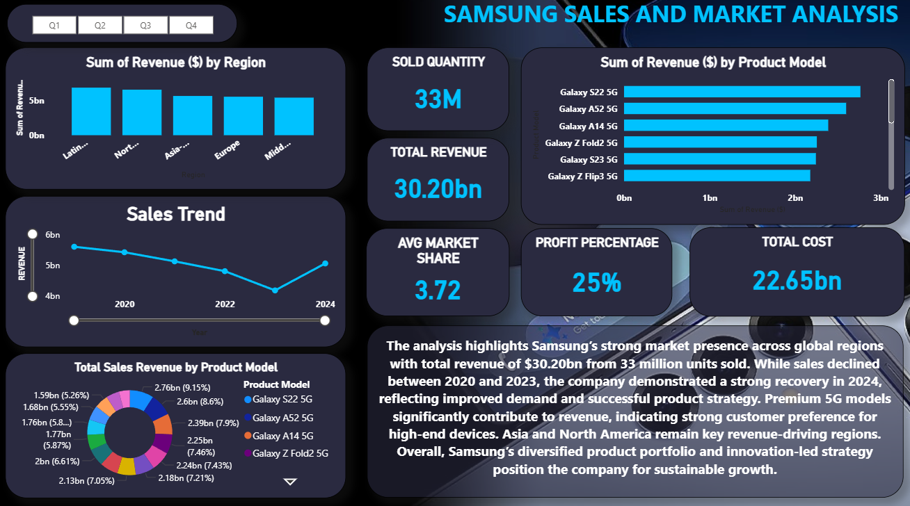

# Samsung Sales & Market Analysis Dashboard

## Project Overview
This project analyzes Samsung sales data to generate business insights using Power BI.  
The goal was to transform raw structured data into an interactive executive-level dashboard for decision-making.

---

## Objective
- Analyze regional sales performance  
- Evaluate product-wise revenue contribution  
- Measure profitability and cost trends  
- Identify sales growth patterns  

---

## Key KPIs
- **Total Revenue:** $30.20bn  
- **Total Cost:** $22.65bn  
- **Profit Margin:** 25%  
- **Units Sold:** 33M  
- **Average Market Share:** 3.72  

---

## Key Insights
- Revenue declined between 2020–2023 but recovered strongly in 2024  
- Premium 5G models contributed significantly to total revenue   
- Product mix directly influenced profitability trends  

---

## Tools & Technologies
- Power BI (Data Visualization & Dashboarding)

- DAX (Calculated Measures & KPI Computation)

- Data Modeling (Relationships & Aggregations)

- Data Cleaning & Transformation

---

## Dashboard Preview

